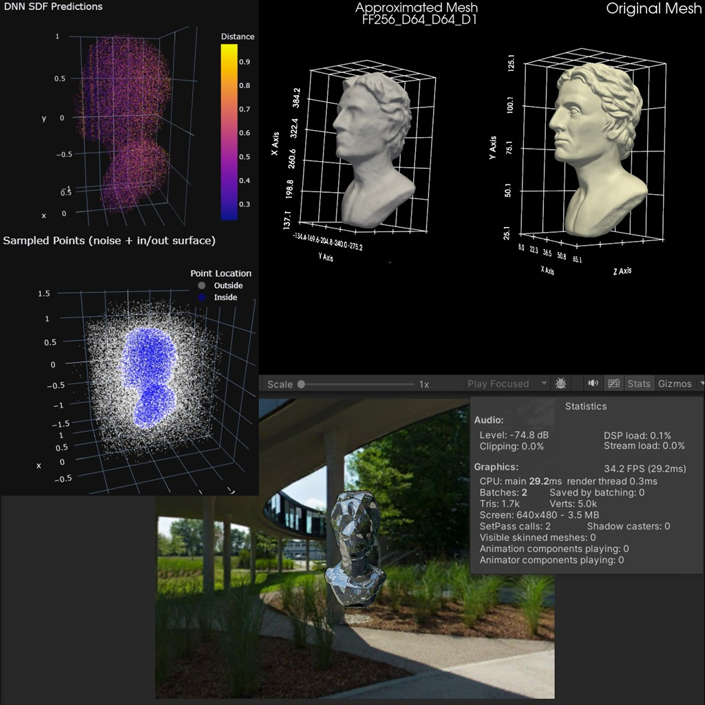

# DeepSDF Approximating Signed Distance Fields Using Deep Neural Networks for Real-time Rendering

The project involves training and fitting small deep neural networks to approximate signed distance fields (SDFs) using Fourier Features. The SDFs are rendered in real-time on Unity with a custom Compute Shader, achieving up to 60 FPS with a two-layer neural network.

The notebook loads a 3D model mesh and samples points on its surface, trains a neural network to approximate the SDF, exports the neural network and its architecture to .TXT file for Unity to load it, and renders the SDF in real-time on Unity using a compute shader.

The UnityRayMarcher folder contains the Unity project with the compute shader and the neural network architecture. The project is built using Unity 2022.3.16f1. Make sure to update the path to the neural network .TXT file in the Compute Shader script before running the scene.

## Meta

Mohamed Hisham – [G-Mail](mailto:Mohamed00Hisham@Gmail.com) | [GitHub](https://github.com/Mhmd-Hisham) | [LinkedIn](https://www.linkedin.com/in/Mhmd-Hisham/)

This project is licensed under the GNU GPLv3 License - check [LICENSE](https://github.com/Mhmd-Hisham/SmartAntsGA/blob/master/LICENSE) for more details.
